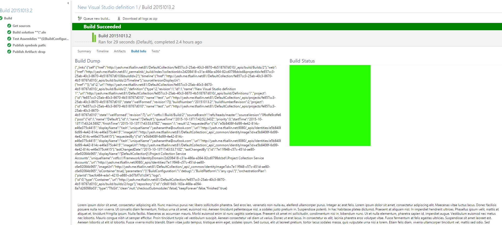
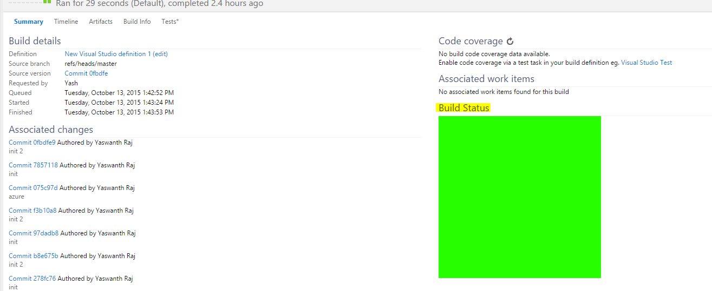

# Extension Samples
for Visual Studio Team Services
 
Samples to help jump-start you in your development of an [Extension for Visual Studio Team Services](http://www.visualstudio.com/integrate/extensions/overview).

## What's available

### Contributions Guide

See the places where you can extend and enhance the user's web experience with an extension ---- right from within the web experience.

* [Learn more](./contributions-guide/readme.md)
* [Install via the Marketplace](https://marketplace.visualstudio.com/items?itemName=ms-samples.samples-contributions-guide)
 
### Build Inspector

Learn about advanced extension concepts like module loading, using UI controls, history, and more.

* [Learn more](./build-inspector/readme.md)
 
Note: this sample is written in TypeScript.

### UI

Explore different UI controls, including menus, toolbars, custom controls, and more.

### Public Events (for Team Calendar)

Custom event source for the [Team Calendar extension](https://github.com/Microsoft/vso-team-calendar) for public holidays. 

### Build Results Enhancer

This sample extension shows how to make a tab/section contribution to build summary page, reacting to build updates.

This also has a sample code that allows user to render custom data results uploaded from a particular task in build.

You could contribute to build results view in different ways:
* As a section to any of your own contributed tab for build results view
* As a section to the existing "summary" tab in build results view
* As a tab to the build results view
 

Contributing as a tab and a section to our own tab -

Contributing as a section to "summary" tab -

This sample is written in TypeScript. The compiled JS files are included in the /out directory, but changes will need to be re-compiled. Open readme.txt for instructions.

