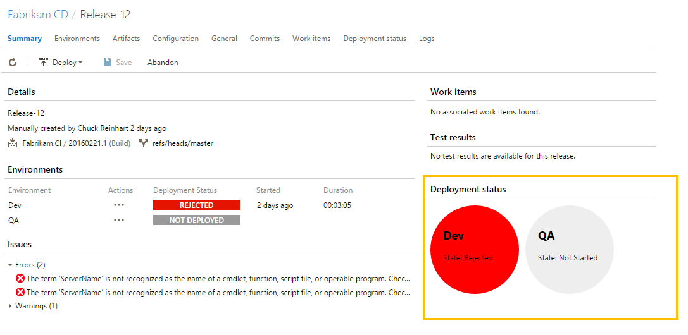
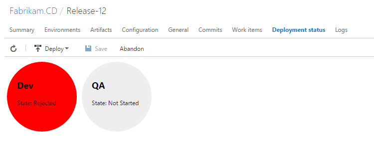

# Visual Studio Team Services Sample Extensions
 
Samples to help jump-start your development of [extensions for Visual Studio Team Services](http://www.visualstudio.com/integrate/extensions/overview).

## Get started

If you plan to package any of the sample extensions, get:

1. [Node.js](https://nodejs.org)
2. [Bower](http://bower.io/) (`npm install -g bower`)
3. [Team Foundation command line interface](https://github.com/Microsoft/tfs-cli)(`npm install -g tfx-cli`)

If you plan to compile any of the sample extensions, get:

3. TypeScript 1.7 or higher (`npm install -g typescript`)
3. Typings (`npm install -g typings`) (manages TypeScript declare files)

### Get the web extension SDK

Each web extension sample has a `bower.json` file, which references third-party libraries used by the sample, including the [Visual Studio Services Web Extension SDK](https://github.com/Microsoft/vss-web-extension-sdk). This JavaScript file is required by all web extensions.

From the directory of the sample, run:

```
bower install
```

### Get TypeScript declare files and compile

Each sample written in [TypeScript](https://github.com/Microsoft/vss-web-extension-sdk) has a `typings.json` file, which references the TypeScript declare files the sample needs to compile. This includes the declare files for Visual Studio Services and Team Foundation types.

From the directory of a sample written in TypeScript, run:

```
typings install
```

Each sample written in TypeScript has a `tsconfig.json` file, which defines the necessary TypeScript compiler settings for the sample.

From the same directory, run:

```
tsc
```

### Try the extension in Visual Studio Team Services

Most samples can be run without any modifications on [Visual Studio Team Services](https://www.visualstudio.com/products/visual-studio-team-services-vs). The steps are:

0. Create a free Visual Studio [Team Services account](https://app.vssps.visualstudio.com/go/profile?account=true)
1. Create a Visual Studio [Marketplace Publisher](https://aka.ms/vsmarketplace-publish) (all extensions are uploaded under a publisher)
2. Verify the extension's manifest file (`vss-extension.json`) either has the `public` attribute set to `false` or is not specified (this ensures your extension is not inadvertently made available to all Team Services users)
3. Package the extension with the ID of your publisher (run `tfx extension create --publisher MYPUBLISHERID`)
4. Upload the produced .vsix file to the [Marketplace](https://aka.ms/vsmarketplace-manage)
5. Share your extension with your Team Services account (right-click on the published extension and select Share)
6. Install the extension into the account (click on the published extension's title and then click Install)

See the [full instructions](https://www.visualstudio.com/en-us/integrate/extensions/publish/overview).

## Available samples

### Contributions Guide


See the places where you can extend and enhance the user's web experience with an extension ---- right from within the web experience.

* [Install via the Marketplace](https://marketplace.visualstudio.com/items?itemName=ms-samples.samples-contributions-guide)
 
### Build Inspector

Learn about advanced extension concepts like module loading, using UI controls, history, and more.
 
Note: this sample is written in TypeScript.

### UI


Explore different UI controls, including menus, toolbars, custom controls, and more.

### Public Events (for Team Calendar)

Custom event source for the [Team Calendar extension](https://github.com/Microsoft/vso-team-calendar) for public holidays. 

### Build Results Enhancer

This sample extension shows how to make a tab/section contribution to build summary page, reacting to build updates.

This also has a sample code that allows user to render custom data results uploaded from a particular task in build.

You could contribute to build results view in different ways:
* As a section to any of your own contributed tab for build results view
* As a section to the existing "summary" tab in build results view
* As a tab to the build results view
 
Contributing as a tab and a section to our own tab -


Contributing as a section to "summary" tab -


This sample is written in TypeScript. The compiled JS files are included in the /out directory, but changes will need to be re-compiled. Open readme.txt for instructions.

### Release deployment status enhancer - Summary
This extension showcases how you can make a summary section contribution to Release page.

Once this extension is installed, it shows an enhanced view of the deployment status to each environment


### Release deployment status enhancer - Tab
This extension showcases how you can make a tab contribution to Release page.

Once this extension is installed, it shows an enhanced view of the deployment status to each environment

