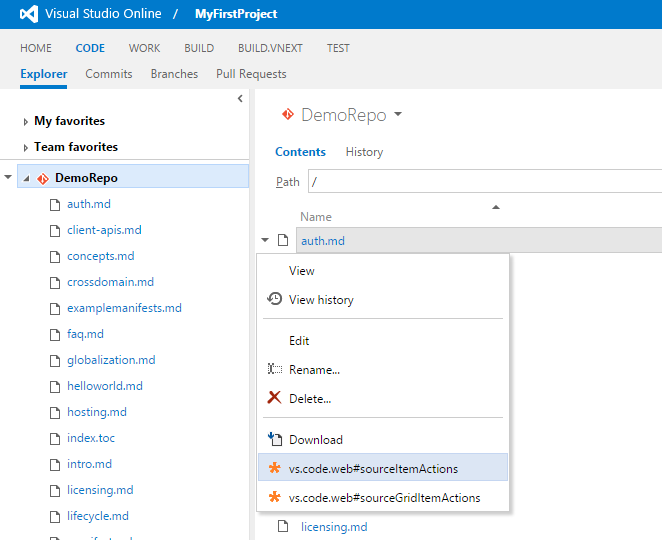
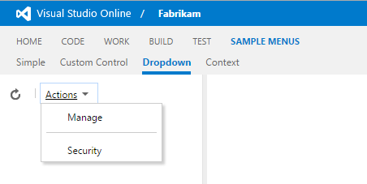

# Visual Studio Online Extension Samples

This repo contains samples to help jump-start you in your development of [Extensions for Visual Studio Online](http://www.visualstudio.com/integrate/extensions/overview).

## Getting started

### Pre-requisites

1. [Join the Visual Studio Partner program](http://www.vsipprogram.com/join) to get early access to the Extensions feature
2. Verify the Extensions feature has been enabled on your account by navigating to ```https://youraccount.visualstudio.com/_admin/_ext```.
3. Available local or cloud web server with HTTPS (IIS, Node.js, Azure Web App, Heroku, etc)

### Steps

1. Clone this repo
2. Browse to the folder of the extension you are interested in trying
3. Publish the contents of the extension to a local or cloud web server
 * The root of the extension should be at the root of the web server, for example: https://myserver/images/fabrikam-logo.png
4. Copy the extension manifest file (`extension.json`) to something like `extension-me.json`
 * You do not need to re-deploy/re-publish after updating this file
5. Update this extension manifest file:
  1. Update the `namespace` field to a globally-unique value. For example: ```johnsmith.samples.build-inspector```
  2. Update the `baseUri` field to be the fully-qualified URL to the root of your web server, for example: `https://myserver`
6. Install the extension into your Visual Studio Online account
  1. Navigate to ```https://youraccount.visualstudio.com/_admin/_ext``` (replace youraccount with your real account name)
  2. Click **Install** and browse to your manifest file, for example extension-me.json
  3. Click **OK**

## What's available

### Branch delete


Clean up old or unneeded Git branches right from within Visual Studio Online.

## Contribution point guide



Discover all the places (called contribution points) in Visual Studio Online you can extend, including hubs, toolbars, and context menus, and more.
 
## Build inspector

Demonstrates advanced extension concepts like AMD loading, using UI controls, history, and more. This sample is written in TypeScript and must be built before it can be installed. Open readme.md for instructions.

## UI



Explore different UI controls, including menus, toolbars, custom controls, and more.

## Public events (for Team Calendar)

Adds an event source to the [Team Calendar extension](https://github.com/Microsoft/vso-team-calendar) for public holidays. Note that this sample contributes *to another extension* rather than core Visual Studio Online.

